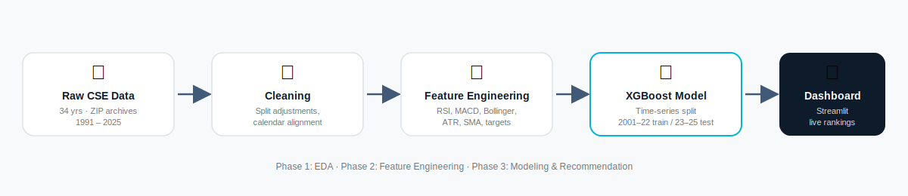

<div align="center">


# 📈 Stock Pulse

**An AI-powered stock recommendation engine built on 34 years of Colombo Stock Exchange (CSE) data.**

[](https://www.python.org/)
[](https://streamlit.io/)
[](https://xgboost.readthedocs.io/)
[](https://pandas.pydata.org/)
[](LICENSE)
[](#)

[Overview](#-overview) • [Features](#-features) • [EDA Highlights](#-exploratory-data-analysis) • [Screenshots](#-dashboard-screenshots) • [Architecture](#-architecture) • [Getting Started](#-getting-started) • [Model Performance](#-model-performance) • [Tech Stack](#-tech-stack)

</div>

---

## 🧭 Overview

**Stock Pulse** is a full end-to-end data science project that turns 34 years of raw Colombo Stock Exchange trading data (1991–2025) into an interactive, AI-driven stock recommendation system.

It's split into two parts:

1. **A data science pipeline** (3 Jupyter notebooks) that ingests, cleans, engineers features for, and models CSE historical data.
2. **A live Streamlit dashboard** (`app.py`) that surfaces the trained model's predictions — ranking stocks by their probability of an upward trend — behind a polished, custom-themed UI.

Built as a final-year university project, but engineered like a production data product: leak-free time-series validation, precision-optimized modeling, and a dashboard designed for someone who actually wants to act on the output.

---

## ✨ Features

| Page | What it does |
|---|---|
| 🏠 **Home** | Market-wide overview — listed companies, total data points, date coverage, market turnover trends, and sector distribution across 300+ companies |
| 📊 **Stock Explorer** | Deep-dive into any CSE-listed company: candlestick charts with SMA 20/50/200 & Bollinger Band overlays, volume, RSI(14), and MACD — filterable by time period |
| 🤖 **AI Recommendations** | XGBoost-ranked stock picks with an uptrend-probability score, adjustable penny-stock and volatility filters, signal tags (🟢 Strong Buy / 🟡 Buy / 🔴 Weak), and CSV export |
| 📈 **Model Performance** | Precision, recall, F1, ROC-AUC & accuracy on a held-out test set, feature importance ranking, confusion matrix, ROC & precision-recall curves, and a visual train/test split breakdown |

**Under the hood:**
- 🧹 Stock-split backward adjustment using official CSE corporate actions data
- 📐 20+ technical indicators — RSI, MACD, Bollinger Bands, ATR, Stochastic Oscillator, SMA family
- 🎯 1M / 3M / 6M forward-return targets with binary uptrend classification
- 🧪 Strict time-series train/test split (train 2001–2022, test 2023–2025) — zero future-data leakage
- ⚖️ Precision-optimized XGBoost & Random Forest classifiers

---

## 🔍 Exploratory Data Analysis

Real output from `01_CSE_Exploratory_Data_Analysis.ipynb`, run against the full 1991–2025 CSE dataset.

<div align="center">

| Market Indices Over Time | Trading Volume Trends |
|---|---|
|  |  |

| Return Distribution | Feature Correlation |
|---|---|
|  |  |

| Volatility Analysis | Trend Analysis |
|---|---|
|  |  |

</div>

Full write-ups for all 16 sections — data quality checks, outlier detection, feature relationships, and time-based feature engineering — are in the [notebook itself](01_CSE_Exploratory_Data_Analysis.ipynb) and its [rendered HTML report](01_CSE_Exploratory_Data_Analysis.html).

---

## 🏗️ Architecture



```
Raw CSE ZIP Archives (1991-2025)
        │
        ▼
 utils/data_loader.py      →  Parses two distinct schema eras, merges yearly files
        │
        ▼
 utils/data_cleaning.py    →  Split adjustments, calendar alignment
        │
        ▼
 utils/features.py         →  20+ technical indicators
 utils/targets.py          →  1M / 3M / 6M forward-return labels
        │
        ▼
 utils/model_trainer.py    →  XGBoost / Random Forest, time-series split
        │
        ▼
 utils/recommender.py      →  Ranks stocks by predicted uptrend probability
        │
        ▼
       app.py              →  Streamlit dashboard (4 pages, live filtering)
```

---

## 📁 Project Structure

```
Stock_Pulse/
├── app.py                                     # Streamlit dashboard (4 pages)
├── 01_CSE_Exploratory_Data_Analysis.ipynb     # Phase 1: EDA
├── 02_Feature_Engineering_and_Targets.ipynb   # Phase 2: Feature engineering
├── 03_Recommendation_System.ipynb             # Phase 3: ML & recommendations
├── utils/
│   ├── __init__.py            # Package exports
│   ├── data_loader.py         # Multi-era data loading from ZIPs
│   ├── data_cleaning.py       # Split adjustments & calendar alignment
│   ├── features.py            # Technical indicators (RSI, MACD, etc.)
│   ├── targets.py             # Forward return target definitions
│   ├── model_trainer.py       # XGBoost & Random Forest training
│   ├── recommender.py         # Stock recommendation engine
│   └── plot_helpers.py        # Publication-quality plot utilities
├── notebook_parts/            # Notebook assembly scripts
├── Dataset/                    # Raw CSE data (not tracked in git — see below)
├── requirements.txt
└── LICENSE
```

---

## 🧠 The Pipeline

### Phase 1 — Exploratory Data Analysis
- Parses 34 years of CSE data (1991–2025) from yearly Excel/CSV files inside ZIP archives
- Handles two distinct schema eras with robust error handling
- 16-section notebook covering distributions, correlations, volatility, and trend analysis

### Phase 2 — Feature Engineering & Target Definition
- Stock split backward adjustments using official CSE corporate actions data
- Technical indicators: SMA, MACD, RSI, Bollinger Bands, ATR, Stochastic Oscillator
- Target variables: 1M, 3M, 6M forward returns with binary uptrend classification labels

### Phase 3 — Machine Learning & Recommendation System
- Time-series train/test split (2001–2022 train, 2023–2025 test) to prevent data leakage
- XGBoost and Random Forest classifiers optimized for precision
- Live recommendation engine that ranks stocks by predicted uptrend probability

---

## 📊 Model Performance

The **Model Performance** page computes these live against the held-out 2023–2025 test set every time it runs, so figures reflect whatever model you've trained — no numbers are hardcoded. It shows:

- Precision, Recall, F1-Score, ROC-AUC, and Accuracy
- Feature importance ranking across all 20+ indicators
- Confusion matrix (predicted vs. actual uptrend)
- ROC curve and Precision-Recall curve
- Train/test sample split visualization

> **Why a time-series split?** Random splits leak future data into training — a common flaw in stock-prediction projects. Stock Pulse trains strictly on 2001–2022 and tests on unseen 2023–2025 data, giving an honest read on real-world performance.

---

## 🚀 Getting Started

### Prerequisites
- Python 3.10+
- Raw CSE historical data (yearly ZIP archives — see [Dataset Setup](#dataset-setup) below)

### Installation

```bash
# Clone the repo
git clone https://github.com/iamdushanl/Stock_Pulse.git
cd Stock_Pulse

# Install dependencies
pip install -r requirements.txt
```

### Dataset Setup

Raw CSE data isn't committed to the repo (see `.gitignore`) due to its size. Place your yearly ZIP archives inside a `Dataset/` folder at the project root — `utils/data_loader.py` expects the standard CSE "Daily Share Price List" export structure per year. Update `BASE_PATH` in `utils/data_loader.py` if your folder layout differs.

### Run the Pipeline

Run the notebooks in order — each phase produces the artifacts the next one needs:

```bash
jupyter notebook
```

1. `01_CSE_Exploratory_Data_Analysis.ipynb` → explores the raw data
2. `02_Feature_Engineering_and_Targets.ipynb` → produces `engineered_features.parquet`
3. `03_Recommendation_System.ipynb` → trains and saves the XGBoost model

### Launch the Dashboard

```bash
streamlit run app.py
```

---

## 🛠️ Tech Stack

| Category | Tools |
|---|---|
| **Language** | Python 3.10+ |
| **Data Processing** | Pandas, NumPy, PyArrow |
| **Machine Learning** | XGBoost, Scikit-learn |
| **Visualization** | Plotly, Matplotlib, Seaborn |
| **Dashboard** | Streamlit |
| **Notebooks** | Jupyter, nbformat |

---

## 🤝 Contributing

Contributions, issues, and feature requests are welcome. Feel free to check the [issues page](https://github.com/iamdushanl/Stock_Pulse/issues) or open a pull request.

---

## 📄 License

University final-year project — Colombo Stock Exchange data used under academic license. Code is released under the [MIT License](LICENSE).

---

<div align="center">

**Built with ❤️ by [Dushan Liyanage](https://github.com/iamdushanl)**

</div>
