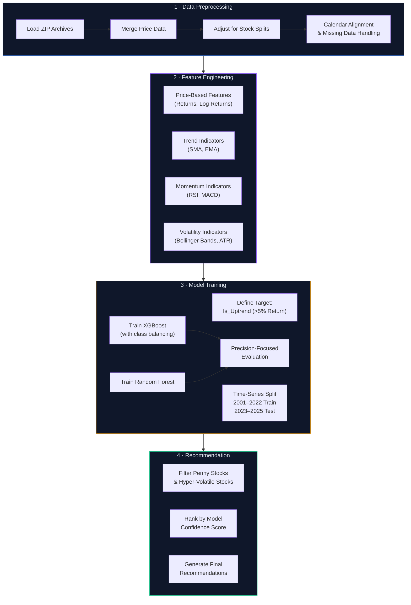

<div align="center">

# 📈 Stock Pulse

### AI-Powered Stock Recommendation Engine for the Colombo Stock Exchange

*Harnessing 34 years of CSE historical data (1991–2025) to predict stock uptrends using machine learning*


[Overview](#-overview) · [Features](#-key-features) · [Architecture](#-architecture) · [Getting Started](#-getting-started) · [How It Works](#-how-the-ml-model-works) · [Results](#-results) · [Contributing](#-contributing)

</div>

---

## 🔭 Overview

**Stock Pulse** is an end-to-end machine learning system that analyzes the **Colombo Stock Exchange (CSE)** — Sri Lanka's principal stock exchange — to generate actionable **buy recommendations** for investors. Built on the most comprehensive publicly available CSE dataset spanning **34 years (1991–2025)**, the system applies modern quantitative finance techniques and gradient-boosted models to identify stocks with a high probability of delivering positive returns.

The project moves beyond simple moving-average crossovers. It constructs **20+ technical indicators** — including RSI, MACD, Bollinger Bands, ATR, and multi-period momentum features — then trains **XGBoost** and **Random Forest** classifiers to predict whether a stock will achieve a **>5% return** over 1-month, 3-month, and 6-month horizons. A strict **time-series train/test split** (training on 2001–2022, testing on 2023–2025) ensures there is absolutely **no future data leakage**, making the evaluation realistic and trustworthy.

The final output is an **interactive Streamlit dashboard** that presents current recommendations, historical performance charts, and model confidence scores — giving investors an intuitive, data-driven tool for the CSE market.

---

## ✨ Key Features

| | Feature | Description |
|---|---|---|
| 📊 | **34 Years of Historical Data** | Complete CSE daily price data from 1991 to 2025 |
| 🧹 | **Automated Stock Split Adjustment** | Prices auto-corrected for subdivisions & splits |
| 📈 | **20+ Technical Indicators** | RSI, MACD, Bollinger Bands, ATR, SMA, EMA & more |
| 🤖 | **XGBoost & Random Forest Models** | Ensemble ML classifiers with hyperparameter tuning |
| 🎯 | **Precision-Optimized** | Minimizes bad recommendations over maximizing recall |
| ⏰ | **Time-Series Split** | No future data leakage — realistic backtesting |
| 🌐 | **Interactive Streamlit Dashboard** | Explore recommendations via a beautiful web UI |
| 📋 | **Multi-Horizon Predictions** | Forecasts for 1-month, 3-month & 6-month windows |

---

## 🏗 Architecture

```mermaid
flowchart LR
    A["🗂 Raw CSE Data\n(ZIP Archives)"] --> B["📥 Data Loader\n(data_loader.py)"]
    B --> C["🧹 Data Cleaning\n(Split Adjustment)"]
    C --> D["⚙️ Feature Engineering\n(20+ Indicators)"]
    D --> E["🎯 Target Definition\n(Is_Uptrend)"]
    E --> F["🤖 ML Training\n(XGBoost / RF)"]
    F --> G["💡 Recommendation\nEngine"]
    G --> H["🌐 Streamlit\nDashboard"]

    style A fill:#1e293b,stroke:#60a5fa,color:#e2e8f0
    style B fill:#1e293b,stroke:#60a5fa,color:#e2e8f0
    style C fill:#1e293b,stroke:#60a5fa,color:#e2e8f0
    style D fill:#1e293b,stroke:#60a5fa,color:#e2e8f0
    style E fill:#1e293b,stroke:#f59e0b,color:#e2e8f0
    style F fill:#1e293b,stroke:#f59e0b,color:#e2e8f0
    style G fill:#1e293b,stroke:#10b981,color:#e2e8f0
    style H fill:#1e293b,stroke:#10b981,color:#e2e8f0
```



---

## 🛠 Tech Stack

<table>
<tr>
<td><b>Category</b></td>
<td><b>Technology</b></td>
<td><b>Purpose</b></td>
</tr>
<tr>
<td>Language</td>
<td></td>
<td>Core language for data science & ML</td>
</tr>
<tr>
<td>Data Processing</td>
<td> </td>
<td>Data wrangling, feature computation</td>
</tr>
<tr>
<td>Visualization</td>
<td>  </td>
<td>Charts, EDA plots, interactive graphs</td>
</tr>
<tr>
<td>Machine Learning</td>
<td> </td>
<td>Gradient boosting & ensemble classifiers</td>
</tr>
<tr>
<td>Dashboard</td>
<td></td>
<td>Interactive web application</td>
</tr>
</table>

---

## 🚀 Getting Started

### Prerequisites

- Python **3.10+**
- CSE Data Handbook files (official dataset from the Colombo Stock Exchange)

### Installation

```bash
# 1. Clone the repository
git clone https://github.com/iamdushanl/Stock_Pulse.git
cd Stock_Pulse

# 2. Install dependencies
pip install -r requirements.txt
```

### Dataset Setup

> [!IMPORTANT]
> The CSE dataset is **not included** in this repository due to licensing. You must obtain the official CSE Data Handbook and place the files in the correct directory.

Place all CSE data files inside the `Dataset/2025 Q4/` directory:

```
Dataset/
└── 2025 Q4/
    ├── 30Daily Shares Price List - 1991-2000.zip
    ├── 31Daily Shares Price List -2001-2010.zip
    ├── 32Daily Shares Price List -2011-2020.zip
    ├── 33Daily Shares Price List -2021-2025.zip
    ├── 05Sub Division (Share Splits).xls
    ├── 07Market Indices - Daily.xls
    └── ... (34 total files)
```

### Running the Notebooks

Execute the notebooks **in order** — each phase builds on the previous one:

```bash
# Phase 1 — Exploratory Data Analysis
jupyter notebook 01_CSE_Exploratory_Data_Analysis.ipynb

# Phase 2 — Feature Engineering & Target Creation
jupyter notebook 02_Feature_Engineering_and_Targets.ipynb

# Phase 3 — Model Training & Evaluation
jupyter notebook 03_Recommendation_System.ipynb
```

### Launching the Dashboard

```bash
# Phase 4 — Interactive Streamlit App
streamlit run app.py
```

The dashboard will open at `http://localhost:8501` in your browser.

---

## 🧠 How the ML Model Works



### Key Design Decisions

| Decision | Rationale |
|---|---|
| **Precision over Recall** | It's better to *miss* a good stock than to *recommend* a bad one — protecting investor capital is the priority |
| **Time-Series Split** | Standard k-fold cross-validation would leak future data into training; a temporal split mirrors real-world deployment |
| **Class Balancing** | Uptrend events are minority class; `scale_pos_weight` in XGBoost compensates for this imbalance |
| **Penny Stock Filter** | Extremely low-priced stocks are excluded to avoid illiquid, high-spread recommendations |
| **Multi-Horizon Targets** | Predicting at 1M, 3M, and 6M horizons gives investors flexibility across different trading strategies |

---

## 📂 Project Phases

### Phase 1 — Exploratory Data Analysis
> **Notebook:** `01_CSE_Exploratory_Data_Analysis.ipynb`

Comprehensive EDA on 34 years of CSE data. Explores price distributions, trading volume patterns, market trends, and sector-level analysis. Identifies data quality issues, missing values, and stock split anomalies that need correction.

### Phase 2 — Feature Engineering & Targets
> **Notebook:** `02_Feature_Engineering_and_Targets.ipynb`

Constructs 20+ technical indicators from raw price/volume data and defines the binary classification target (`Is_Uptrend`) based on forward returns exceeding 5% across multiple time horizons.

### Phase 3 — Model Training & Recommendation
> **Notebook:** `03_Recommendation_System.ipynb`

Trains XGBoost and Random Forest classifiers using a temporal train/test split. Evaluates models with precision-focused metrics and builds the recommendation engine that filters and ranks stocks.

### Phase 4 — Interactive Dashboard
> **App:** `app.py`

A Streamlit-based web dashboard that presents model recommendations, historical charts, and confidence scores in an interactive, investor-friendly interface.

---

## 📊 Results

> [!NOTE]
> Model performance is evaluated on the **held-out test set (2023–2025)** using a strict time-series split — no future information leaks into training.

| Metric | Description |
|---|---|
| **Precision** | Primary metric — measures how many recommended stocks actually went up |
| **Recall** | Secondary metric — measures how many actual uptrends were captured |
| **F1 Score** | Harmonic mean balancing precision and recall |
| **ROC-AUC** | Overall discriminative ability of the model |

*Detailed performance metrics, confusion matrices, and precision-recall curves are available in the Phase 3 notebook.*

---

## 📁 Project Structure

```
Stock_Pulse/
│
├── 📓 01_CSE_Exploratory_Data_Analysis.ipynb   # Phase 1: EDA
├── 📓 02_Feature_Engineering_and_Targets.ipynb  # Phase 2: Feature Engineering
├── 📓 03_Recommendation_System.ipynb            # Phase 3: ML Models
├── 🌐 app.py                                    # Phase 4: Streamlit Dashboard
├── 📋 requirements.txt                          # Python dependencies
├── 📄 LICENSE                                   # MIT License
├── 📖 README.md                                 # You are here
│
├── Dataset/
│   └── 2025 Q4/                                 # CSE data files (not in repo)
│       ├── 30Daily Shares Price List - 1991-2000.zip
│       ├── 31Daily Shares Price List -2001-2010.zip
│       ├── 32Daily Shares Price List -2011-2020.zip
│       ├── 33Daily Shares Price List -2021-2025.zip
│       ├── 05Sub Division (Share Splits).xls
│       ├── 07Market Indices - Daily.xls
│       └── ... (34 total files)
│
├── utils/                                        # Core library modules
│   ├── __init__.py
│   ├── data_loader.py                            # Loads CSE data from ZIP archives
│   ├── data_cleaning.py                          # Stock split adjustment, alignment
│   ├── features.py                               # Technical indicator generation
│   ├── targets.py                                # Forward return & uptrend labels
│   ├── model_trainer.py                          # XGBoost + Random Forest training
│   ├── recommender.py                            # Recommendation engine
│   └── plot_helpers.py                           # Publication-quality visualizations
│
├── notebook_parts/                               # Notebook section scripts
│   ├── sections_0_to_7.py
│   └── sections_8_to_16.py
│
├── assemble_notebook.py                          # Notebook assembly utilities
├── build_phase2_notebook.py
└── build_phase3_notebook.py
```

---

## 🤝 Contributing

Contributions are welcome! Whether it's bug fixes, new features, or documentation improvements — all contributions help make Stock Pulse better.

1. **Fork** the repository
2. **Create** a feature branch (`git checkout -b feature/amazing-feature`)
3. **Commit** your changes (`git commit -m 'Add amazing feature'`)
4. **Push** to the branch (`git push origin feature/amazing-feature`)
5. **Open** a Pull Request

> [!TIP]
> If you have access to CSE data and want to contribute additional analysis or model improvements, please open an issue first to discuss the approach.

---

## 📄 License

This project is licensed under the **MIT License** — see the [LICENSE](LICENSE) file for details.

---

<div align="center">

### Built with ❤️ by [Dushan Lakruwan](https://github.com/iamdushanl)

[](https://github.com/iamdushanl)

*If you find this project useful, consider giving it a ⭐ on [GitHub](https://github.com/iamdushanl/Stock_Pulse)!*

</div>
