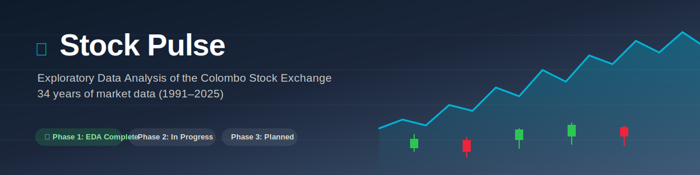
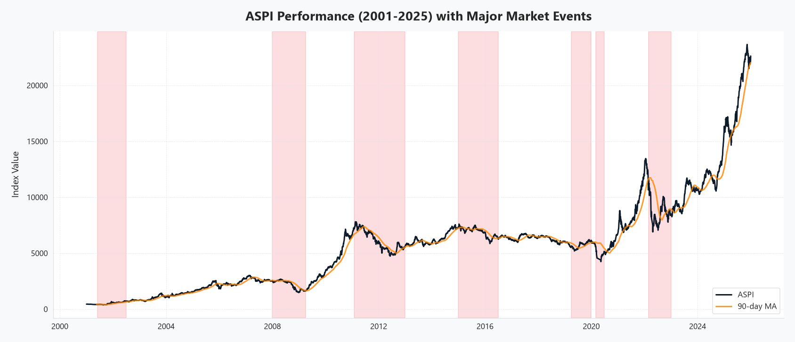
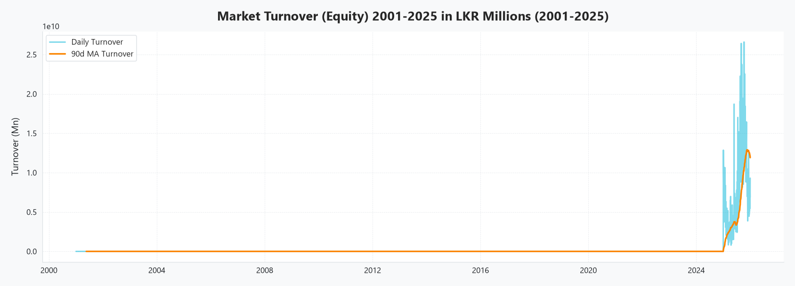
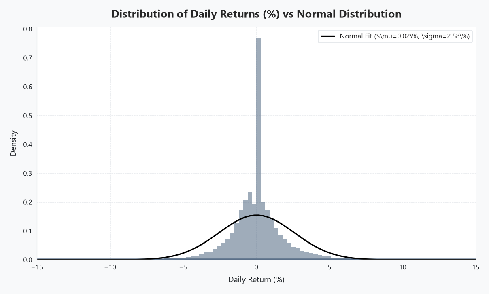
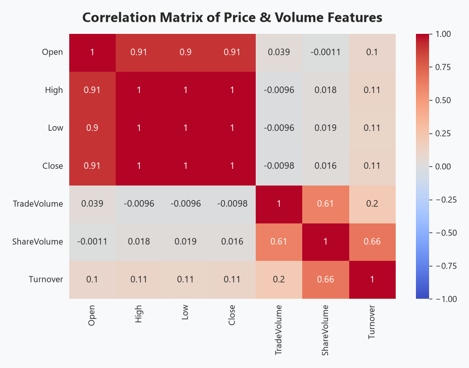
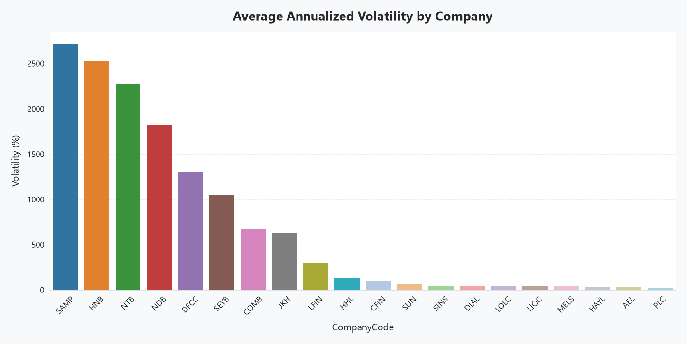
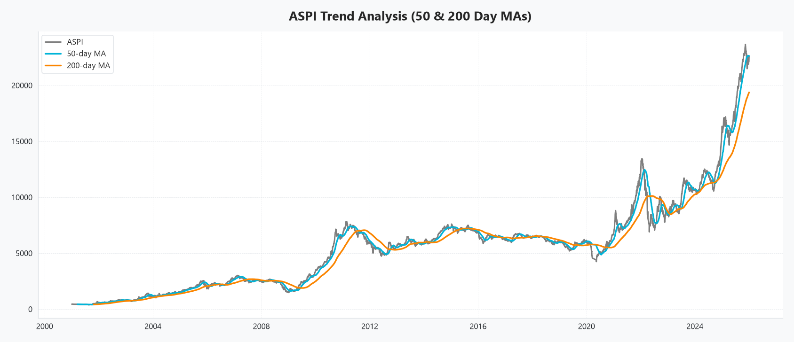
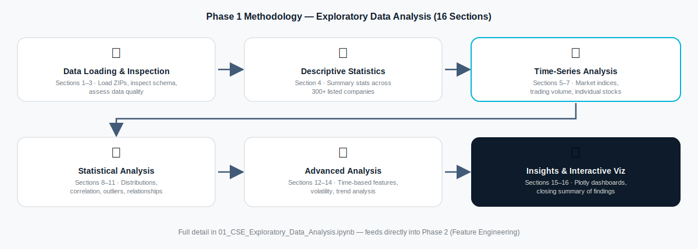

<div align="center">



# 📈 Stock Pulse

**Exploratory data analysis of 25 years of Colombo Stock Exchange (CSE) trading history — the foundation for an upcoming ML-based stock recommendation system.**

[](https://www.python.org/)
[](https://jupyter.org/)
[](https://pandas.pydata.org/)
[](LICENSE)
[](#-project-status)

[Overview](#-overview) • [Project Status](#-project-status) • [EDA Highlights](#-exploratory-data-analysis) • [Methodology](#-methodology) • [Project Structure](#-project-structure) • [Getting Started](#-getting-started) • [Roadmap](#-roadmap)

</div>

---

## 🧭 Overview

**Stock Pulse** is a data science project analyzing 25 years of historical trading data (2001–2025) from the Colombo Stock Exchange (CSE), working toward an ML-powered stock recommendation system.

**Where it stands right now:** Phase 1 — a full exploratory data analysis across 300+ listed companies — is complete. Feature engineering (Phase 2) and the modeling/recommendation engine (Phase 3) are in active development, and a Streamlit dashboard UI has been scaffolded ahead of them. This README reflects that real state rather than describing features that aren't live yet — the sections below are grounded in what's actually been run and verified.

---

## 📍 Project Status

| Phase | Status | Notes |
|---|---|---|
| **1. Exploratory Data Analysis** | ✅ **Complete** | 16-section notebook, run against the full 1991–2025 dataset. See highlights below. |
| **2. Feature Engineering & Targets** | 🔧 In Progress | Notebook drafted (technical indicators, forward-return targets) — not yet executed end-to-end. |
| **3. ML Modeling & Recommendation Engine** | 📋 Planned | XGBoost / Random Forest training notebook drafted; no trained model yet. |
| **Interactive Dashboard** (`app.py`) | 📋 Planned | UI fully scaffolded (4 pages), but depends on artifacts from Phases 2–3 that don't exist yet. |

---

## 🔍 Exploratory Data Analysis

Real output from `01_CSE_Exploratory_Data_Analysis.ipynb`, run against the full CSE dataset.

<div align="center">

| Market Indices Over Time | Trading Volume Trends |
|---|---|
|  |  |

| Return Distribution | Feature Correlation |
|---|---|
|  |  |

| Volatility Analysis | Trend Analysis |
|---|---|
|  |  |

</div>

**What the notebook covers, section by section:**
- Data loading from 25 years of yearly ZIP archives across two distinct schema eras
- Data quality assessment and descriptive statistics across 300+ companies
- Time-series analysis of market indices, trading volume, and individual stocks
- Distribution, correlation, and outlier analysis
- Time-based feature engineering, volatility analysis, and trend analysis
- Interactive Plotly visualizations and a closing summary of findings

Full detail — including all 16 sections, data quality checks, and feature-relationship analysis — is in the [notebook itself](01_CSE_Exploratory_Data_Analysis.ipynb) or its [rendered HTML report](01_CSE_Exploratory_Data_Analysis.html).

---

## 🧪 Methodology



---

## 📁 Project Structure

```
Stock_Pulse/
├── 01_CSE_Exploratory_Data_Analysis.ipynb     # ✅ Phase 1: EDA (complete, this README's focus)
├── 02_Feature_Engineering_and_Targets.ipynb   # 🔧 Phase 2: Feature engineering (drafted)
├── 03_Recommendation_System.ipynb             # 📋 Phase 3: ML & recommendations (drafted)
├── app.py                                      # 📋 Streamlit dashboard (UI scaffolded, not yet wired to a trained model)
├── utils/
│   ├── __init__.py            # Package exports
│   ├── data_loader.py         # Multi-era data loading from ZIPs
│   ├── data_cleaning.py       # Split adjustments & calendar alignment
│   ├── features.py            # Technical indicators (RSI, MACD, etc.)
│   ├── targets.py             # Forward return target definitions
│   ├── model_trainer.py       # XGBoost & Random Forest training
│   ├── recommender.py         # Stock recommendation engine
│   └── plot_helpers.py        # Publication-quality plot utilities
├── notebook_parts/            # Notebook assembly scripts
├── assets/                    # README images (banner, methodology diagram, EDA charts)
├── Dataset/                    # Raw CSE data (not tracked in git — see below)
├── requirements.txt
└── LICENSE
```

---

## 🚀 Getting Started

The instructions below cover what's runnable **today** — Phase 1. Phases 2–3 and the dashboard will get their own setup steps once they're complete.

### Prerequisites
- Python 3.10+
- Raw CSE historical data (yearly ZIP archives — see [Dataset Setup](#dataset-setup) below)

### Installation

```bash
# Clone the repo
git clone https://github.com/iamdushanl/Stock_Pulse.git
cd Stock_Pulse

# Install dependencies
pip install -r requirements.txt
```

### Dataset Setup

Raw CSE data isn't committed to the repo (see `.gitignore`) due to its size. Place your yearly ZIP archives inside a `Dataset/` folder at the project root — `utils/data_loader.py` expects the standard CSE "Daily Share Price List" export structure per year. Update `BASE_PATH` in `utils/data_loader.py` if your folder layout differs.

### Run the EDA Notebook

```bash
jupyter notebook 01_CSE_Exploratory_Data_Analysis.ipynb
```

---

## 🗺️ Roadmap

- [x] **Phase 1** — Exploratory Data Analysis across 34 years of CSE data
- [ ] **Phase 2** — Finish and validate feature engineering (technical indicators + forward-return targets)
- [ ] **Phase 3** — Train and evaluate XGBoost / Random Forest models with a time-series train/test split
- [ ] **Dashboard** — Wire up `app.py` to real model output and publish live screenshots
- [ ] **Model Performance** — Publish precision/recall/ROC-AUC once a model is trained and validated

---

## 🛠️ Tech Stack

| Category | Tools | Status |
|---|---|---|
| **Language** | Python 3.10+ | In use |
| **Data Processing** | Pandas, NumPy, PyArrow | In use (Phase 1) |
| **Visualization** | Matplotlib, Seaborn, Plotly | In use (Phase 1) |
| **Notebooks** | Jupyter, nbformat | In use |
| **Machine Learning** | XGBoost, Scikit-learn | Planned (Phase 3) |
| **Dashboard** | Streamlit | Planned |

---
## 👥 Project Team

This repository is part of a **3rd-year university group project** focused on building an ML-powered stock recommendation system using historical Colombo Stock Exchange (CSE) data.

### My Contribution
- ✅ Designed and completed the complete Phase 1 Exploratory Data Analysis (EDA)
- ✅ Developed the data loading and preprocessing pipeline for the historical CSE dataset
- ✅ Created the visualizations and statistical analysis presented in this repository
- ✅ Authored the project documentation (README)

Future phases—including feature engineering, machine learning models, recommendation engine, and dashboard integration—are being developed collaboratively by the project team.

## 📄 License

University 3rd-year group project — Colombo Stock Exchange data used under academic license. Code is released under the [MIT License](LICENSE).

---

<div align="center">

**Academic Group Project**

EDA and documentation by **Dushan Liyanage**

</div>
